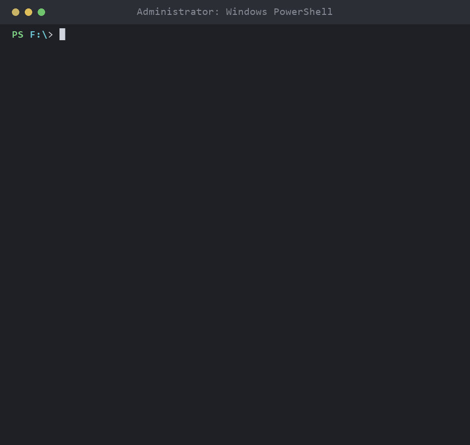
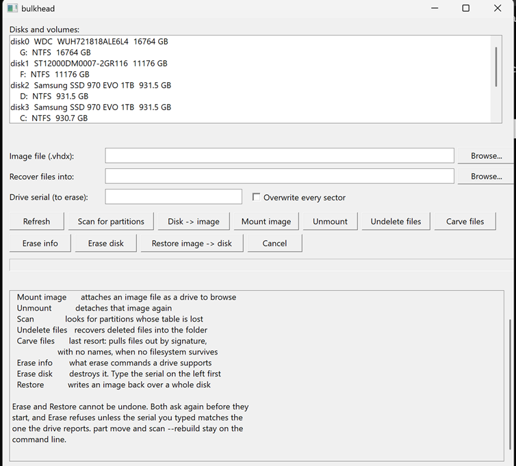

# bulkhead

Free, open block-level backup and recovery for Windows.

Macrium killed Reflect Free. Acronis went subscription. EaseUS, AOMEI and
MiniTool ship nagware that lets you *make* a backup and then paywalls the
restore. Paragon charges ~$40 per filesystem to read ext4 on Windows. Blancco
charges per drive for an ATA command and a PDF.

*Prices and product status as of August 2026.*

Sister project to [futureburn](https://github.com/sp00nznet/futureburn),
[pstfree](https://github.com/sp00nznet/pstfree) and
[vncfree](https://github.com/sp00nznet/vncfree) — same attitude: find the
Windows payware, read the published spec it is hiding behind, give it away.
[Why](PHILOSOPHY.md).

None of this is hard science. Most of it is already implemented **inside
Windows** — VSS, VHDX differencing disks, `AttachVirtualDisk`, ATA/NVMe
sanitize commands. The paid tools are charging for the integration. bulkhead is
that integration, given away.

> ⚠️ Pre-alpha, but every command works and is verified on real hardware.
> Nothing has been tried against a real *system* disk yet, and the recovery ISO
> has been built but never booted. `restore` and `part move` write to disks and
> are not undoable — read what they print before saying yes.



_Rendered with [termshot](https://github.com/sp00nznet/termshot) from a real
bench run; the drive's serial is a placeholder. Source: [`docs/demo.py`](docs/demo.py)._

And the same engine with a window on it, for the machine that is already
broken and the person who does not want a command line:



## Why VHDX

The format choice carries most of the feature list, so it's worth being explicit:

| What the paid tools charge for | What bulkhead does |
|---|---|
| Block-level snapshot of a live volume | `Win32_ShadowCopy` → read the shadow device raw |
| Whole-disk image that boots | GPT copied verbatim; VHDX sized to match the source |
| Incremental chains | VHDX **differencing disks** — Windows tracks the blocks |
| Mount-image-as-a-drive | `AttachVirtualDisk` — it shows up in Explorer |
| Bootable recovery media | WinPE (ADK) + a `startnet.cmd` |
| Restore to bare metal | Copy the partition back; WinPE boots the VHDX directly |

A proprietary image format is how you get locked in. A VHDX opens in Explorer,
in Hyper-V, in `Mount-DiskImage`, and in every other tool on the platform — with
or without bulkhead installed.

## A library, and who runs it

This repo is a library with the desktop program on top of it. The split that
matters is **who runs the thing**: bulkhead is the desktop build, for a person
at a broken machine with one disk in front of them. GUI, recovery media,
undelete, carve, erase. No service, no scheduler, nothing that wants a
credential.

Unattended and scheduled work — service accounts, credential stores, running
across many machines — is deliberately not here. It belongs to a separate
program built on this same library, and the separation is the point: a
scheduler dependency that creeps into a desktop tool does not announce itself.

The filesystem readers live in the library rather than in the program, because
"get three files off this Linux disk" is a desktop job that file-level restore
also needs.

## Install

Needs Rust and an **elevated** prompt (raw volume access).

```
cargo build --release
```

That produces two executables, and the Releases page carries the same two:

| | |
|---|---|
| `bulkhead.exe` | the command line. Everything below. |
| `bulkhead-gui.exe` | [the window](docs/gui.md), on its own. |

They are the same engine: the window shells out to `bulkhead.exe` sitting
next to it for every operation, so it can get the arguments wrong but never
the disk. `bulkhead gui` opens the same window from the command line.

## Usage

```
bulkhead image <VOL|diskN> <OUT.vhdx> [--from <PARENT.vhdx>] [--no-snapshot]
bulkhead mount <IMAGE.vhdx> [--rw]
bulkhead unmount <IMAGE.vhdx>
bulkhead restore <IMAGE.vhdx> <diskN> [--yes]
bulkhead part list <diskN>
bulkhead part move <diskN> <N> --to <OFFSET> [--yes]
bulkhead scan <diskN> [--rebuild] [--yes]
bulkhead undo <diskN> <TABLE.bin> [--yes]
bulkhead undelete <VOL|diskN> --to <DIR> [--at <OFFSET>]
bulkhead carve <VOL|diskN> --to <DIR> [--limit <N>]
bulkhead identify <VOL|diskN> [--at <OFFSET>]
bulkhead erase-info <diskN>
bulkhead erase <diskN> [--method <M>] [--yes] [--cert <FILE>]
bulkhead ls <VOL|diskN> [PATH] [--at <OFFSET>]
bulkhead cp <VOL|diskN> <PATH> --to <DIR> [--at <OFFSET>]
bulkhead mount-fs <VOL|diskN|IMAGE> <X:> [--at <OFFSET>]
bulkhead gui
bulkhead media <OUT.iso>
```

```powershell
# full image of the system volume, taken live via VSS
bulkhead image C: D:\backups\c-full.vhdx

# incremental: a differencing disk that only stores what changed
bulkhead image C: D:\backups\c-mon.vhdx --from D:\backups\c-full.vhdx

# browse it. read-only by default; it appears as a drive in Explorer
bulkhead mount D:\backups\c-mon.vhdx
bulkhead unmount D:\backups\c-mon.vhdx
```

`--no-snapshot` reads the volume directly instead of through VSS. Only for
volumes nothing is writing to — an offline disk, or a drive you just plugged in.

### Recovery media

```powershell
bulkhead media D:\bulkhead-recovery.iso
```

Builds bootable WinPE with bulkhead in it. Needs the **Windows ADK** and its
**WinPE add-on** — two separate downloads from <https://aka.ms/adk>, because
WinPE stopped shipping inside the ADK at 1809.

WinPE has no PowerShell in its base image, and bulkhead partitions its target
with the Storage cmdlets, so the media adds `WinPE-WMI`, `WinPE-NetFX`,
`WinPE-Scripting`, `WinPE-PowerShell` and `WinPE-StorageWMI`. That is most of
the build time and most of the ISO size.

VSS does not exist in WinPE either, so imaging from the media is always
`--no-snapshot`. That costs nothing: nothing in WinPE is writing to the disk
you are imaging.

Takes a few minutes, almost all of it DISM, and produces a ~534 MB ISO. For a
USB stick instead of an ISO, the workspace is left in place:

```powershell
MakeWinPEMedia /UFD "$env:TEMP\bulkhead-winpe" F:
```

## Status

`smoke.ps1` builds a throwaway 512 MB NTFS volume, images it, takes an
incremental, mounts the image back and compares a file hash across both. Run it
elevated.

Measured on that volume -- 496 MB with 106 MB in use, one small file added
between the two images:

| | before used-clusters-only | after |
|---|---|---|
| full image | 256 MB | **38 MB** |
| incremental | 255 MB | **35 MB** |
| reported as changed | 18.2 MB | **2.6 MB** |
| whole-disk image | - | **36 MB** (512 MB disk) |

`restore` puts that 512 MB image onto a 1 GB disk and relocates the GPT, so all
512 MB of the extra space comes back as usable free space rather than being
stranded behind a partition table describing the old disk.

- [x] `image <VOL>` — VSS snapshot → dynamic VHDX, GPT + one partition
- [x] `image diskN` — whole disk: verbatim GPT, per-partition VSS, raw gaps.
      Same size as the source, so it attaches and boots directly
- [x] `image --from` — differencing disk, unchanged blocks left unallocated
- [x] `mount` / `unmount` — `AttachVirtualDisk`, read-only by default
- [x] **used-clusters only** (`FSCTL_GET_VOLUME_BITMAP`) — free space is never
      read and never written
- [x] `restore` — erase a disk and write an image back, GPT relocated if the
      target is bigger. Refuses the disk hosting the running system
- [x] `scan` / `scan --rebuild` — find filesystems whose partition table is
      gone and write a new GPT pointing at them
- [x] `undelete` — recover deleted files from NTFS, resident and non-resident
- [x] `undo` — put back a table saved by `scan --rebuild`
- [x] `carve` — signature-based recovery when no filesystem survives
- [ ] verify (hash the image against the source)
- [ ] scheduling, retention, chain merge
- [x] WinPE recovery media (`bulkhead media`) — ISO; `/UFD` for USB
- [x] GUI (`bulkhead gui`) — native Win32, no toolkit, runs in WinPE;
      progress bar, cancel, and `erase`/`restore` behind the engine's own prompts
- [x] `ls` / `cp` — read ext2/3/4, XFS and HFS+ volumes Windows cannot mount
- [x] `identify` — RAID/LVM/ZFS/btrfs/bcachefs membership and format recognition
- [x] `mount-fs` — ext4/XFS/HFS+ as a read-only Windows drive, via WinFsp
- [x] `erase-info` — what erase commands a drive supports, and what blocks them
- [x] `erase --method overwrite` — zero every sector, then sample-verify
- [x] `erase` via firmware sanitize — ATA SANITIZE block erase, run end to
      end on a SATA SSD; the certificate reads Purge
- [x] erase certificate (`--cert`) — JSON for a machine, a printable page for
      a person, written whether it passed or failed
- [ ] the certificate is unsigned: nothing ties the paper to the record
- [ ] MBR disks are read by `part list` and `identify`, but `part move`
      still writes GPT only
- [ ] tested against a real system disk; BitLocker images as ciphertext
- [ ] the ISO has been built but never booted

## Roadmap

The five things people currently pay for. Each one builds on the last:

1. **Imaging + recovery media** — **done.** The Reflect Free replacement.
   Outstanding: `verify`, scheduling/retention/chain merge.
2. **Partition manager** — **done for GPT.** `part move` is the operation
   nobody gives away; see [Partitioning](docs/partitioning.md) for what is
   deliberately left to Windows.
   MBR disks are now read rather than refused — `part list` and `identify`
   follow the extended chain and report logical partitions. Outstanding:
   nothing writes an MBR, so `part move` is still GPT-only.
3. **Data recovery** — *in progress.* `scan` finds filesystems whose partition
   table is gone and rebuilds it, which is TestDisk's headline feature.
   **done.** `scan` rebuilds a lost partition table, `undelete` recovers files
   from a surviving MFT, `carve` works from raw signatures when there is none,
   and `bulkhead gui` fronts all of it.
4. **Filesystem drivers** — *in progress.* `ls` and `cp` read ext2/3/4, XFS
   and HFS+; `identify` recognises MD RAID, LVM2, ZFS, btrfs, bcachefs,
   SquashFS, UFS2 and VMFS members. Outstanding: F2FS and UFS2 reading, APFS,
   btrfs reading, and exposing them all as mountable volumes via WinFsp.
5. **Certified secure erase** — *in progress.* `erase-info` reports what a
   drive supports and what blocks it; `erase --method overwrite` wipes a drive
   and verifies by sampling, confirmed on real hardware; `--cert` produces the
   record afterwards. The ATA SANITIZE block-erase path has now been run end to
   end on a SATA SSD, and its certificate reads Purge. Outstanding: crypto
   scramble on a drive that offers it, the NVMe equivalents, and signing the
   certificate.

Linux and macOS are a stretch goal. Windows first, because that's where the
gap is.


## Documentation

The README is the entry point; each capability has its own page.

| | |
|---|---|
| [Partitioning](docs/partitioning.md) | `part list`, `part move`, and what is deliberately left to Windows |
| [Data recovery](docs/recovery.md) | `scan` a lost partition table, `undelete` from NTFS, `carve` from raw bytes |
| [Reading ext2/3/4, XFS and HFS+](docs/filesystems.md) | `ls`, `cp`, `mount-fs`, and how they are verified |
| [What is this disk?](docs/identify.md) | `identify`: RAID, LVM, ZFS, btrfs and friends |
| [Secure erase](docs/secure-erase.md) | `erase-info`, `erase`, and the certificate |
| [The window](docs/gui.md) | `bulkhead gui` |
| [Design notes](docs/design.md) | shortcuts taken, granularity numbers, known limits |

## The sister projects

| | |
|---|---|
| [futureburn](https://github.com/sp00nznet/futureburn) | CD, DVD and Blu-ray burning, ripping and image mounting. |
| [pstfree](https://github.com/sp00nznet/pstfree) | Read, export and repair Outlook PST/OST files without Outlook. |
| [vncfree](https://github.com/sp00nznet/vncfree) | A VNC client and server with no subscription and no ad-gated download. |

Same method every time: read the published spec, call the OS API that is
already there, ship one executable, MIT. Why that is worth doing at all is
written down in **[PHILOSOPHY.md](PHILOSOPHY.md)**.

## License

MIT.
